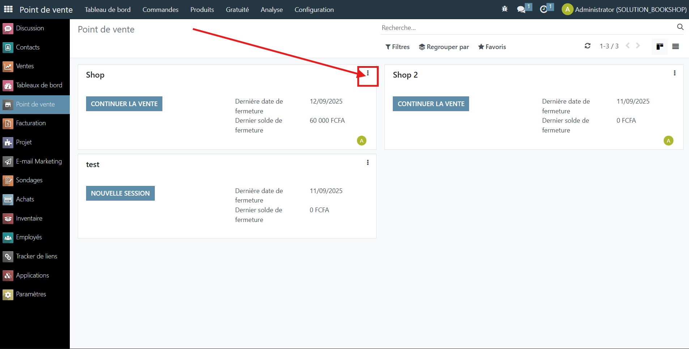

# 📦 POS Order Limit

  
  
  

---

# 🧩 Overview

**POS Order Limit** is an Odoo module that helps Point of Sale operators manage pending orders more effectively. It introduces a configurable threshold to prevent new orders from being created when too many are left unprocessed. This improves cashier workflow, reduces clutter, and ensures smoother operations in busy retail environments.

---

## ✨ Features

- Set a maximum number of pending orders per POS session  
- Block new orders when the threshold is reached  
- Display warning messages to cashiers  
- Simple configuration via POS settings  
- Lightweight and compatible with Odoo 16

---

## ⚙️ Configuration

1. Go to **Point of Sale > Configuration > POS Settings**  
2. Set the **maximum number of pending orders allowed**  
3. Enable the **blocking feature** if needed

---

## 🧪 How to Test

- Open the POS interface  
- Create multiple orders and leave them pending  
- Observe the blocking behavior once the limit is reached  
- Process or delete pending orders to resume normal flow

## 📸 Screenshots

You can add screenshots in `static/description/` and reference them in your documentation or GitHub page:

## 📜 License

This module is licensed under the **AGPL-3**.

---

## 👤 Author

Developed by **Loïc Cabrel Tekeu** (Alt Plus)  
🔗 [GitHub](https://github.com/tekeu10)  
🔗 [LinkedIn](https://www.linkedin.com/in/lo%C3%AFc-cabrel-tekeu-1b7b9125b)

---
